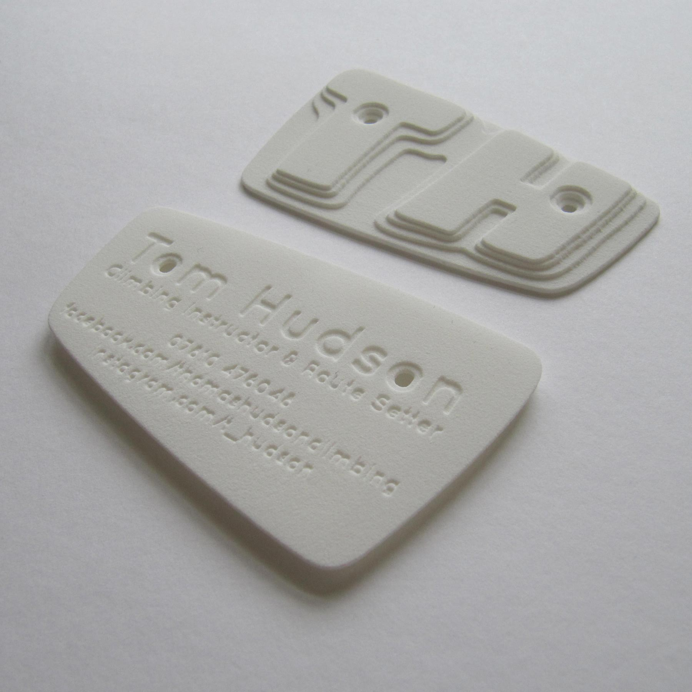
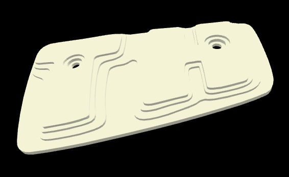

# 3D Business Card Model

Business Card for climbing instructor and route setter, Tom Hudson. Github pages link: [martinbagshaw.github.io/climbing-business-card/](https://martinbagshaw.github.io/climbing-business-card/).

Model made using [Blender](https://www.blender.org/), converted to JSON, and brought to life with [three.js](https://threejs.org/).

Uses [http-server](https://www.npmjs.com/package/http-server) to run the model locally.

[This hackernoon.com article](https://hackernoon.com/publishing-a-threejs-project-on-github-pages-1d1a33dn) demonstrates a simple github pages setup for three.js.

_3D printed version_

_Three.js version_
